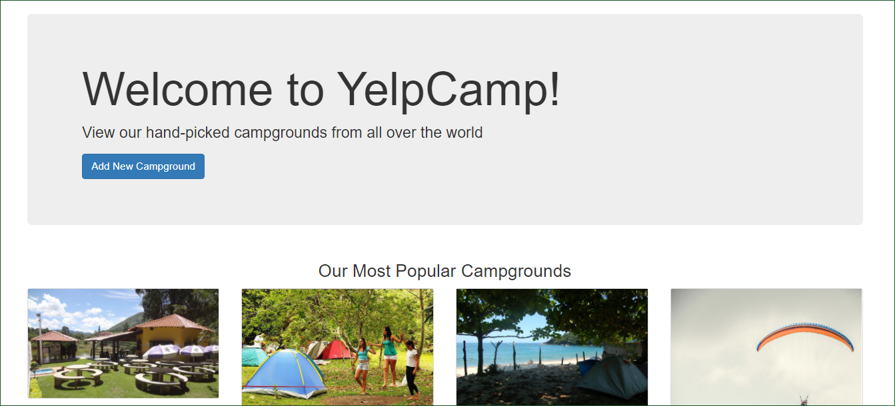
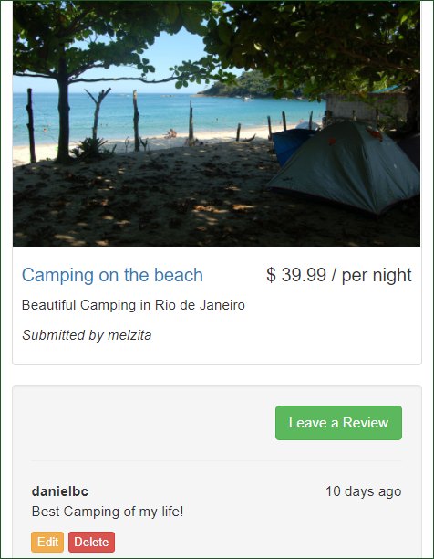

# YelpCamp
YelpCamp is a platform of campgrounds for connecting campground owners and users from all around the world. It is a project  from the Web Development Bootcamp made with Node.js  that shows registered campgrounds and uses authentication for campgrounds authors and user's comments.

<!-- [YelpCamp Website](https://enigmatic-sea-52160.herokuapp.com/) -->

## Tech/framework used
* Node.Js
* Express
* Mongodb
* Passport

## Features
* Signup
* Login
* Logout
* View registered campgrouds
* Create, edit and delete campgrounds and comments from a login user

## Installation - npm
* express
* express-session
* mongoose
* ejs
* passport
* passport-local
* passport-local-mongoose
* body-parser

  

